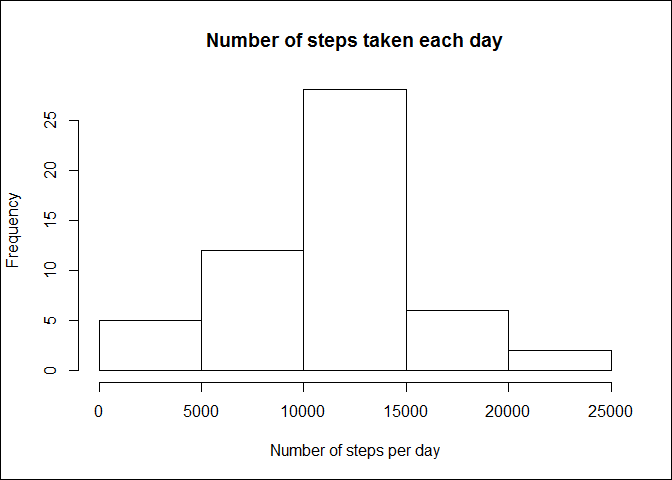
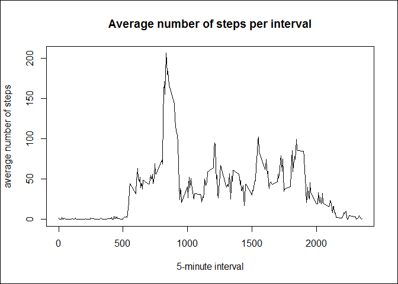
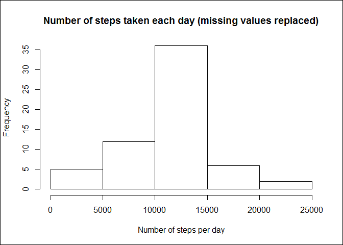
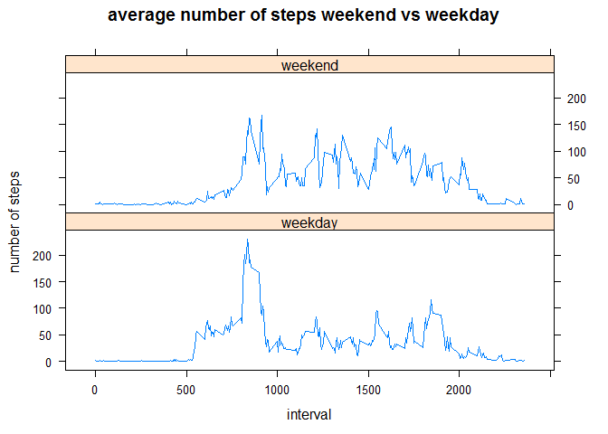

# Reproducible Research: Peer Assessment 1
L.J.J. Timmermans  


## Loading and preprocessing the data
### Load necessary packages

```r
library(lubridate)
```

```
## 
## Attaching package: 'lubridate'
```

```
## The following object is masked from 'package:base':
## 
##     date
```

```r
library(dplyr)
```

```
## 
## Attaching package: 'dplyr'
```

```
## The following objects are masked from 'package:lubridate':
## 
##     intersect, setdiff, union
```

```
## The following objects are masked from 'package:stats':
## 
##     filter, lag
```

```
## The following objects are masked from 'package:base':
## 
##     intersect, setdiff, setequal, union
```

```r
library(lattice)
```

### Load the data (i.e. read.csv())

```r
ActivityData <- read.csv(unz("activity.zip", "activity.csv"), header = TRUE)
```

Get info about the data in the file:

```r
str(ActivityData)
```

```
## 'data.frame':	17568 obs. of  3 variables:
##  $ steps   : int  NA NA NA NA NA NA NA NA NA NA ...
##  $ date    : Factor w/ 61 levels "2012-10-01","2012-10-02",..: 1 1 1 1 1 1 1 1 1 1 ...
##  $ interval: int  0 5 10 15 20 25 30 35 40 45 ...
```

### Process/transform the data (if necessary) into a format suitable for your analysis
Convert the date variable from factor to dates using lubridate:

```r
ActivityData$date <- ymd(ActivityData$date)
str(ActivityData)
```

```
## 'data.frame':	17568 obs. of  3 variables:
##  $ steps   : int  NA NA NA NA NA NA NA NA NA NA ...
##  $ date    : Date, format: "2012-10-01" "2012-10-01" ...
##  $ interval: int  0 5 10 15 20 25 30 35 40 45 ...
```

## What is mean total number of steps taken per day?
### Make a histogram of the total numer of steps taken each day
Calculate the total number of steps taken each day

```r
StepsPerDay <- ActivityData %>% 
        group_by(date) %>% 
        summarize(SumSteps=sum(steps))
```

Put the data in a histogram

```r
hist(StepsPerDay$SumSteps,
     main = 'Number of steps taken each day',
     xlab = 'Number of steps per day')
box("outer")
```

<!-- -->

### Calculate and report the mean and median total number of steps taken per day
Mean:

```r
mean(StepsPerDay$SumSteps, na.rm = TRUE)
```

```
## [1] 10766.19
```
Median:

```r
median(StepsPerDay$SumSteps, na.rm = TRUE)
```

```
## [1] 10765
```

## What is the average daily activity pattern?
### Make a time series plot (i.e. type = "l") of the 5-minute interval (x-axis) and the average number of steps taken, averaged across all days (y-axis)
Calculate the mean number of steps per 5-minute interval

```r
StepsByInterval <- ActivityData %>% 
        group_by(interval) %>% 
        summarize(MeanSteps=mean(steps, na.rm=TRUE))
```
Put the mean steps per interval in a line chart

```r
with(StepsByInterval, 
     plot(x=interval, 
          y=MeanSteps, 
          type='l', 
          main='Average number of steps per interval', 
          xlab='5-minute interval', 
          ylab = 'average number of steps'))
box("outer")
```

<!-- -->

### Which 5-minute interval, on average across all the days in the dataset, contains the maximum number of steps?
Subset the row containing maximum value in StepsByInterval using which.max to
get the answer.

```r
StepsByInterval[which.max(StepsByInterval$MeanSteps),]
```

```
## # A tibble: 1 × 2
##   interval MeanSteps
##      <int>     <dbl>
## 1      835  206.1698
```

## Imputing missing values
### Calculate and report the total number of missing values in the dataset (i.e. the total number of rows with NAs)
Since the only column containing measurements is the column with the number of
steps. This is the only column that can contain missing values.
Number of rows with missing values:

```r
sum(is.na(ActivityData$steps))
```

```
## [1] 2304
```

### Devise a strategy for filling in all of the missing values in the dataset. The strategy does not need to be sophisticated. For example, you could use the mean/median for that day, or the mean for that 5-minute interval, etc.
Strategy for filling the missing values: use average number of steps for the interval of the missing data.

#### Create a new dataset that is equal to the original dataset but with the missing data filled in.
To fill in the missing values, we will check each row for a missing value. If there is a missing value, we will put the average number of steps for the given interval of that row.

```r
ActivityDataRmNA <- ActivityData
for (i in 1:nrow(ActivityDataRmNA)) {
        if (is.na(ActivityDataRmNA$steps[i])) {
                # Find the rownumber for the interval in StepsByInterval
                Rownr <- which(ActivityDataRmNA$interval[i] == StepsByInterval$interval)
                # Assign the value to replace the NA
                ActivityDataRmNA$steps[i] <- StepsByInterval[Rownr,]$MeanSteps
                }
        }
```
Check to see if all missing values have been replaced by calculating the number of rows with missing values in the number of steps.

```r
sum(is.na(ActivityDataRmNA$steps))
```

```
## [1] 0
```

### Make a histogram of the total number of steps taken each day and Calculate and report the mean and median total number of steps taken per day. Do these values differ from the estimates from the first part of the assignment? What is the impact of imputing missing data on the estimates of the total daily number of steps?
Calculate the total number of steps taken each day

```r
StepsPerDayRmNa <- ActivityDataRmNA %>% 
        group_by(date) %>% 
        summarize(SumSteps=sum(steps))
```

Put the data in a histogram

```r
hist(StepsPerDayRmNa$SumSteps,
     main = 'Number of steps taken each day (missing values replaced)',
     xlab = 'Number of steps per day')
box("outer")
```

<!-- -->

### Calculate and report the mean and median total number of steps taken per day
Mean:

```r
mean(StepsPerDayRmNa$SumSteps, na.rm = TRUE)
```

```
## [1] 10766.19
```
Median:

```r
median(StepsPerDayRmNa$SumSteps, na.rm = TRUE)
```

```
## [1] 10766.19
```
The mean of the data has not changed due to strategy if filling the missing values. The median has changed a bit and is equal to the mean now.  
The impact of imputing missing values seems quite small in this case.

## Are there differences in activity patterns between weekdays and weekends?
### Create a new factor variable in the dataset with two levels - "weekday" and "weekend" indicating whether a given date is a weekday or weekend day.

```r
ActivityDataRmNA$DayType <-
        as.factor(
                ifelse(as.POSIXlt(ActivityDataRmNA$date)$wday %in% c(0,6), 
                       'weekend', 
                        'weekday')
        )

str(ActivityDataRmNA)
```

```
## 'data.frame':	17568 obs. of  4 variables:
##  $ steps   : num  1.717 0.3396 0.1321 0.1509 0.0755 ...
##  $ date    : Date, format: "2012-10-01" "2012-10-01" ...
##  $ interval: int  0 5 10 15 20 25 30 35 40 45 ...
##  $ DayType : Factor w/ 2 levels "weekday","weekend": 1 1 1 1 1 1 1 1 1 1 ...
```

### Make a panel plot containing a time series plot (i.e. type = "l") of the 5-minute interval (x-axis) and the average number of steps taken, averaged across all weekday days or weekend days (y-axis).
First calculate the average number of steps per interval for weekdays and weekend days.

```r
StepsByIntervalByDayType <- ActivityDataRmNA %>% 
         group_by(interval, DayType) %>% 
         summarize(MeanSteps=mean(steps, na.rm=TRUE))
```

Put the data in a panel plot using the lattice system.

```r
with(StepsByIntervalByDayType, 
        xyplot(MeanSteps~interval | DayType,
               main='average number of steps weekend vs weekday',
               ylab = 'number of steps',
               type='l',
               layout=c(1,2)
               )
     )
```

<!-- -->
